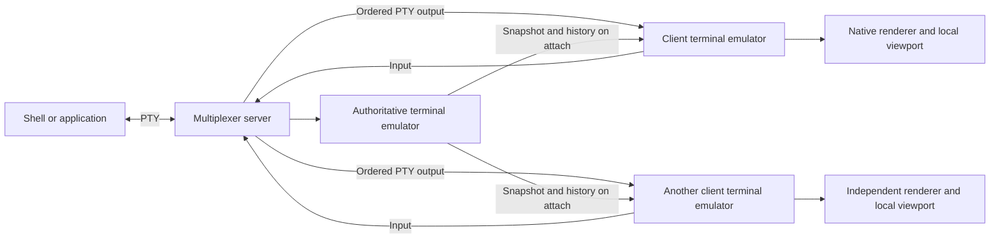
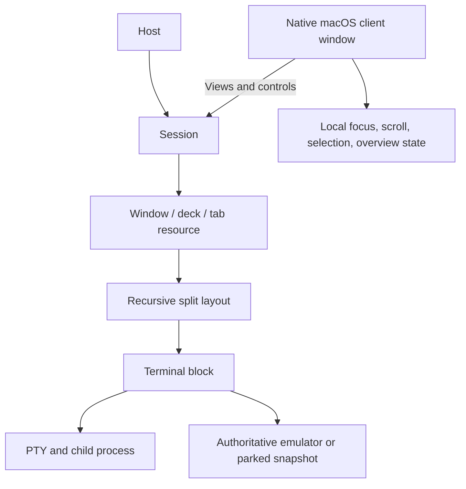

# Architecture evidence and implementation boundaries

This document distinguishes the developers' explanations, public upstream code, and engineering choices proposed for illogical. It does not describe access to Superlogical's private source or promise wire compatibility.

## The described architecture

Mitchell's architecture explanation [V02](https://x.com/mitchellh/status/2082936029426892960) is the primary source. The central distinction is that the server keeps an authoritative terminal emulator while clients also maintain terminal state and render natively. Clients receive PTY output rather than a stream of server-rendered screen differences.

This diagram summarizes the narration, not the undisclosed transport implementation.

### Attaching to a running terminal

At V02 1:57-3:21, the server briefly stops advancing the terminal at a coherent boundary, serializes terminal state, and sends enough state for the client to render the active screen. That state includes much more than printable text: dimensions, modes, cursor, active screen, and parser state matter.

A readiness boundary lets the client become usable before the complete scrollback arrives. At 5:00 onward, the explanation describes history loading asynchronously, newest portions first. Scrolling into history that has not arrived can display a loading state. The exact locking and output-buffering mechanism in Superlogical is not public.

### Live output and input

At V02 3:29 onward, raw PTY output is distributed to connected terminal engines and also processed by the authoritative server engine. The intention is to avoid putting a server screen-diff/render/reparse chain on the client's rendering path. A slow authoritative parser need not prevent already-available bytes reaching the client, subject to whatever buffering guarantees the implementation uses.

At 4:23, input is centralized and serialized through the server. Several clients can observe and submit input; the statement does not establish a single-human-writer restriction. A faithful implementation must define ordering across keyboard input, programmatic writes, terminal-generated replies, resizes, and reconnects. The public video does not define that entire ordering protocol.

Client viewports and text selection are local. This is replicated terminal interpretation, not video streaming and not a consensus protocol such as Raft. At 5:59, a fresh snapshot is described as a way to resynchronize a divergent client.

### Layout and compatibility

At V02 7:10, windows, tabs, and splits are native client layout rather than a terminal-drawn multiplexed screen. Each terminal is an independently addressable stream. The CLI later exposes sessions, windows, blocks, and clients.

At 7:52 onward, compatibility with a full legacy multiplexed layout is undecided. Attaching a single terminal stream from another terminal through a compatibility renderer is described as intended. Do not claim arbitrary existing terminals can consume the native snapshot protocol directly.

## Public implementation evidence in Ghostty

The [announcement](https://mitchellh.com/writing/superlogical) says Superlogical uses the same publicly available MIT-licensed libghostty components and contributes shared improvements upstream. The author separately identifies **Go for server/networking, Swift for Apple clients, and Zig for lower-level bindings** in [P01](https://x.com/mitchellh/status/2082623830510710865).

The public Ghostty tree was inspected at commit `27e8b3fa85d9cf8c7cd5ae2ced348bcb0a4fba9c`. Pinning the reference is important because these APIs are evolving.

| Public source | What it establishes |
|---|---|
| [C snapshot API, G03](https://github.com/ghostty-org/ghostty/blob/27e8b3fa85d9cf8c7cd5ae2ced348bcb0a4fba9c/include/ghostty/vt/snapshot.h) | Complete terminal snapshot encode/decode, an early READY boundary, deferred history, and decoder options. |
| [Snapshot implementation, G04](https://github.com/ghostty-org/ghostty/blob/27e8b3fa85d9cf8c7cd5ae2ced348bcb0a4fba9c/src/terminal/snapshot/main.zig) | Ordered binary records, integrity checks, versioning, and terminal-state serialization. |
| [C snapshot example, G05](https://github.com/ghostty-org/ghostty/tree/27e8b3fa85d9cf8c7cd5ae2ced348bcb0a4fba9c/example/c-vt-snapshot) | A concrete integration reference for the public API. |

The inspected format uses a `GHOSTSNP` marker, version 1, and CRC32C-protected records. Conceptually the stream progresses through terminal metadata, active-screen records, continuation state, READY, history pages, and FINISH. History arrives from newer to older pages. These names describe the inspected revision and are not a permanent product protocol.

Important engineering details from the header:

- A snapshot can preserve unfinished VT/UTF-8 parsing, provided continuation tracking is enabled as required by the API.
- Encoding requires that the source terminal not mutate concurrently.
- A decoder may become ready before it has received every history page.
- After readiness, the client can process live output or resize while history decoding continues. History pages that are unsafe to apply after such changes can be validated but skipped.
- The API includes `ghostty_snapshot_encode`, buffer/allocation variants, decoder creation, readiness, iteration, decoding, configuration, and cleanup operations.

The snapshot implementation is a substantial reusable foundation, but it is not a complete multiplexer. Authentication, routing, RPC, PTY ownership, flow control, client identities, and layout persistence still belong to the application.

Likewise, **libghostty-vt is not by itself a drop-in SwiftUI terminal view**. State emulation, a Metal renderer, font shaping, keyboard/IME handling, clipboard integration, and accessibility are separate integration concerns. Before committing to the client bridge, verify which public embedding surface supports externally supplied terminal streams and restored snapshots without spawning a second local child process.

## Resource parking

The [memory explanation, V11](https://x.com/mitchellh/status/2095232081853039041) describes three related optimizations:

1. **Emulator parking:** after roughly 60 seconds without PTY output, serialize terminal state to disk and release the in-memory emulator. PTY input alone does not necessarily wake it; output that must be interpreted does. Even a terminal with an attached but idle viewer can park.
2. **PTY reader parking:** active terminals use dedicated blocking readers. Idle or unobserved PTYs can move onto a shared `kqueue`/`epoll`-style poller, releasing per-terminal thread resources. Readability wakes normal processing.
3. **Client buffer release:** idle client-side buffers can be freed and rebuilt when activity resumes.

The explanation also says a new client may attach by reading a parked snapshot without first waking the server emulator. The shell or application remains running throughout. This does not suspend the Unix process, checkpoint its address space, or make it survive a machine reboot.

The video contains impressive memory and restoration-time comparisons. Their workload, measurement boundary, hardware, and repeatability were not established by this research, so they are not acceptance targets. The explicit qualitative target is memory proportional to active work, with inexpensive dormant terminals and fast reattachment.

## Remote login and transport

[V12](https://x.com/mitchellh/status/2097424868203758046) demonstrates a Linux host with proper login sessions, user shell initialization, principal/actor identity, and remote directory operations. [P05](https://x.com/mitchellh/status/2097430395667271799) says the system can run through SSH or provide direct PAM-respecting login. [P06](https://x.com/mitchellh/status/2097431305168605319), read alongside its parent, confirms QUIC and fallback protocols. It does not identify a specific QUIC version or library.

[P07](https://x.com/mitchellh/status/2093565819909542332) describes each server registering as a Tailscale node; [P08](https://x.com/mitchellh/status/2082634453474795885) describes service advertisement and client discovery. A separate [reply, P10](https://x.com/mitchellh/status/2089399515740819484) calls the data protocol custom and bidirectional. These establish direction, not a public wire schema or authentication design.

## Proposed model for illogical

The following is a design proposal derived from the evidence, not a recovered internal class model.

The demonstrated CLI's `window` resource appears related to a tab/deck containing blocks. It should not be equated blindly with an `NSWindow`. Session, window, deck, tab, and client-view relationships need a small explicit model before implementation. Per-client focus versus shared focused-window metadata also needs a defined policy.

Recommended component boundaries:

| Component | Responsibility | Basis |
|---|---|---|
| Native Swift application | AppKit/SwiftUI windowing, Metal terminal surfaces, input, commands, gestures, themes, directory chooser. | Mirrors the stated Apple stack and observed UI. |
| Go service and CLI | Process lifetime, PTYs, resource identities, layout control, session state, connections, events, remote services. | Mirrors the stated server language and demonstrated API. |
| Pinned libghostty bridge | Terminal parsing, snapshots, search/state queries, bindings into both service and client as appropriate. | Uses public upstream capabilities. Exact bridge requires validation. |
| Local connection | An authenticated user-local channel, initially a permission-restricted Unix socket. | Proposed implementation choice, not a claim about Rex. |
| Remote connection | A negotiated encrypted channel, eventually QUIC/fallback and Tailscale integration for observed parity. | Direction is evidenced; packet and authentication formats remain our design. |

Keep resource IDs stable across detach/attach. Keep layout mutation independent of process creation. Treat the CLI and GUI as consumers of the same service operations. Define version negotiation explicitly, because snapshot compatibility cannot be assumed between arbitrary Ghostty revisions.

## Decisions that must be resolved through engineering

- A coherent attach boundary: precisely order snapshot, subsequent PTY bytes, resize, and client readiness so no data is lost or replayed twice.
- Terminal-generated replies: prevent several client emulators from independently sending duplicate device responses to one PTY.
- Size ownership: the inspected API exposes an owner and desired sizes, but does not disclose the arbitration policy.
- Backpressure: bound memory when a client is slow without stalling every other client or corrupting the authoritative terminal.
- Reconnection: decide when buffered replay is safe and when a new snapshot is required.
- Parking races: coordinate a new output byte, new attachment, resize, and snapshot persistence during eviction.
- Crash consistency: write snapshots and metadata atomically; distinguish recoverable terminal display state from unrecoverable process lifetime.
- Surface integration: establish a supported path from restored terminal state to native rendering, input, selection, and search.
- Security boundaries: map authenticated identities to permitted sessions and Unix actors before adding privileged direct login.

These are concrete implementation obligations inferred from the observed behavior. The previews do not reveal how Superlogical resolves every one of them.
